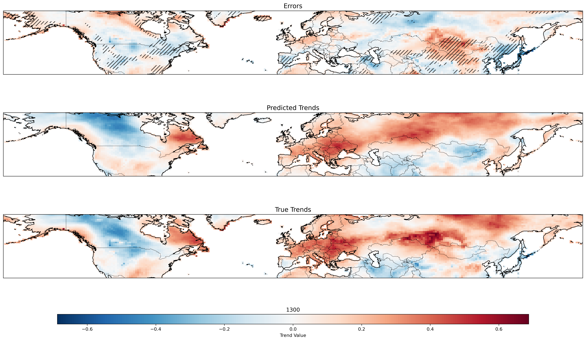
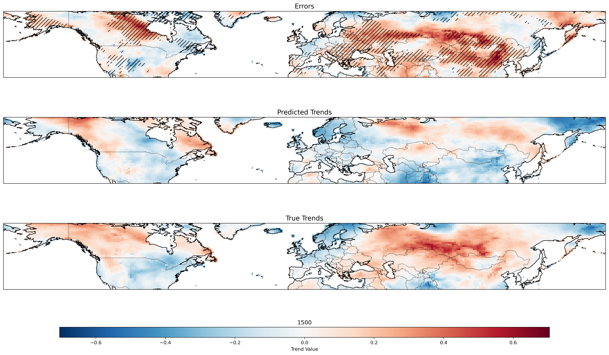

# DEA Dynamical Adjustment

This repository contains code for performing Direct Effect Analysis (DEA) to separate dynamical and thermodynamical signals in temperature simulations.

## Files

- **`DEA_Dyn_Ad_final.ipynb`**  
  Jupyter notebook implementing DEA on `TREFHT_day_b.e212.BHISTcmip6.f09_g17`, using `Z500_day_b.e212.BHISTcmip6.f09_g17` as a dynamical control variable.

- **`direct_effect_analysis.py`**  
  Python script containing the DEA implementation. Key functionalities:
  - Instantiate the `DirectEffectAnalysis` class with `n_components='optimal'` to select the best number of components via k-fold cross-validation, or set a fixed number manually.
  - Use `fit(X, Y, Z)` to train the model:
    - `X`: Dynamical proxies (e.g., Z500)
    - `Y`: Target variable (e.g., temperature)
    - `Z`: External forcing proxy (e.g., GMT)
    - Set `fit_test=False` when statistical significance testing is not required.
  - Use `counterfactual(Y, Z_counterfactual)` to estimate counterfactual values of `Y` given factual `Y` and counterfactual external forcing (`Z_counterfactual`). The method outputs thermodynamical and dynamical components, whose sum provides a counterfactual estimate of `Y`.

 - **`DEA_axriv.pdf`**
     Paer in revision.

---

## Results

### Run **1300**

| Metric                   | Value    |
|--------------------------|---------|
| Trends R²               | 0.339865 |
| Trends Correlation      | 0.636125 |
| Correct Trend Sign      | 0.730985 |
| Time Series R²         | 0.833537 |
| Time Series Correlation | 0.918909 |

### Run **1400**

| Metric                   | Value    |
|--------------------------|---------|
| Trends R²               | -0.090225 |
| Trends Correlation      | 0.426897 |
| Correct Trend Sign      | 0.631448 |
| Time Series R²         | 0.838760 |
| Time Series Correlation | 0.920476 |

### Run **1500**

| Metric                   | Value    |
|--------------------------|---------|
| Trends R²               | 0.076695 |
| Trends Correlation      | 0.528368 |
| Correct Trend Sign      | 0.673280 |
| Time Series R²         | 0.853456 |
| Time Series Correlation | 0.927744 |

